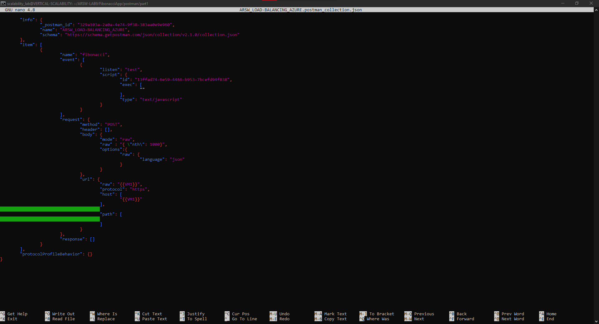
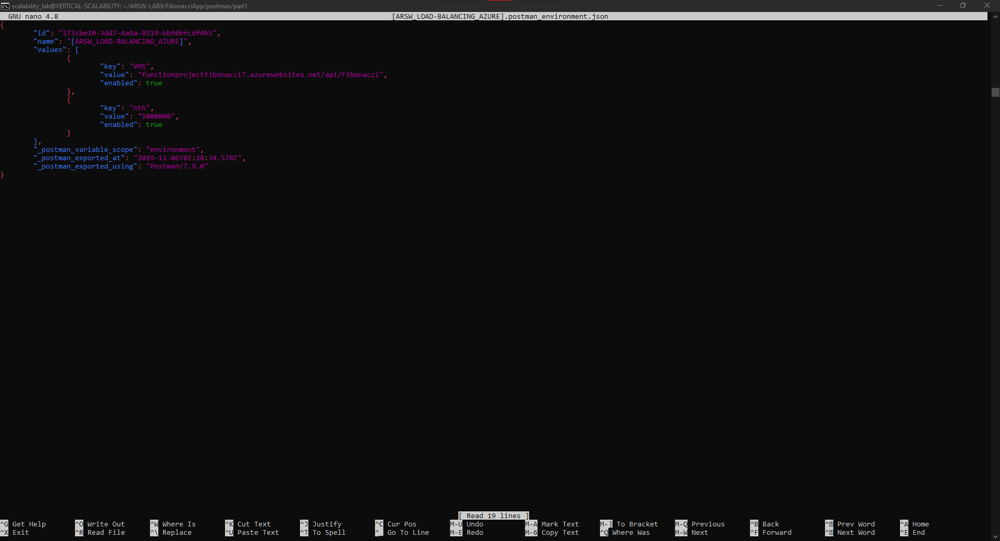
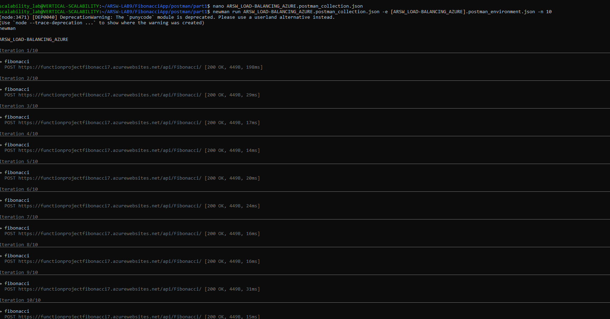
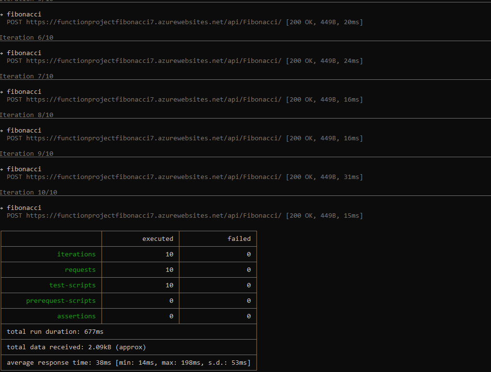
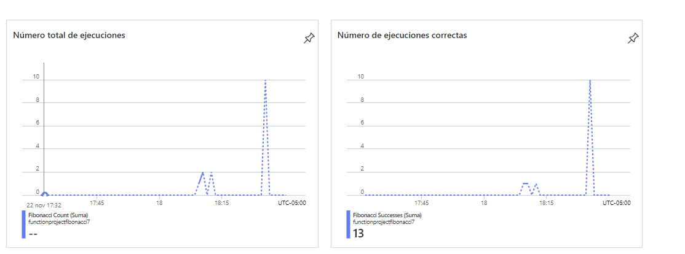
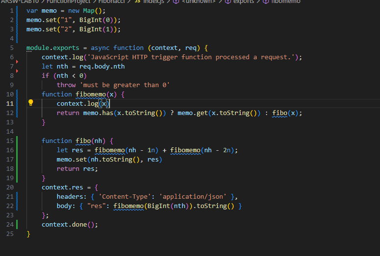

### Escuela Colombiana de Ingeniería
### Arquitecturas de Software - ARSW

### Juan Pablo Daza Pinzon - Juan Sebastian Rodriguez Peña

## Escalamiento en Azure con Maquinas Virtuales, Sacale Sets y Service Plans

### Dependencias
* Cree una cuenta gratuita dentro de Azure. Para hacerlo puede guiarse de esta [documentación](https://azure.microsoft.com/es-es/free/students/). Al hacerlo usted contará con $100 USD para gastar durante 12 meses.
Antes de iniciar con el laboratorio, revise la siguiente documentación sobre las [Azure Functions](https://www.c-sharpcorner.com/article/an-overview-of-azure-functions/)

### Parte 0 - Entendiendo el escenario de calidad

Adjunto a este laboratorio usted podrá encontrar una aplicación totalmente desarrollada que tiene como objetivo calcular el enésimo valor de la secuencia de Fibonnaci.

**Escalabilidad**
Cuando un conjunto de usuarios consulta un enésimo número (superior a 1000000) de la secuencia de Fibonacci de forma concurrente y el sistema se encuentra bajo condiciones normales de operación, todas las peticiones deben ser respondidas y el consumo de CPU del sistema no puede superar el 70%.

### Escalabilidad Serverless (Functions)

1. Cree una Function App tal cual como se muestra en las  imagenes.

2. Instale la extensión de **Azure Functions** para Visual Studio Code.

3. Despliegue la Function de Fibonacci a Azure usando Visual Studio Code. La primera vez que lo haga se le va a pedir autenticarse, siga las instrucciones.

4. Dirijase al portal de Azure y pruebe la function.

5. Modifique la coleción de POSTMAN con NEWMAN de tal forma que pueda enviar 10 peticiones concurrentes. Verifique los resultados y presente un informe.

  
  
  
  
  

6. Cree una nueva Function que resuleva el problema de Fibonacci pero esta vez utilice un enfoque recursivo con memoization. Pruebe la función varias veces, después no haga nada por al menos 5 minutos. Pruebe la función de nuevo con los valores anteriores. ¿Cuál es el comportamiento?.

  

**Preguntas**

* ¿Qué es un Azure Function?

Es una solución que permite escribir menos código, con menos infraestructura y asi ahorrar costos, por lo cual no hay que preocuparse por mantener servidores ya que la nube proporciona todos los recursos necesarios para mantener las aplicaciones en ejecución, y generalmente este se ejecuta dentro de contenedores sin estado 

* ¿Qué es serverless?

Significa sin servidor, es un modelo que proporciona el proveedor de la nube en el cual no es necesario aprovisionar y administrar infraestructura, lo que permite crear y ejecutar aplicaciones con rapidez y a un menor costo

* ¿Qué es el runtime y que implica seleccionarlo al momento de crear el Function App?

El runtime es el tiempo de ejecución y al seleccionarlo actúa como un sistema operativo que proporciona las funciones necesarias para que los programas se ejecuten. Carga todas la aplicaciones de un programa y las pone a correr en una plataforma especifica. De las cuales se pueden seleccionar las funciones básicas para la memoria, redes y el hardware necesario para la ejecución de la función

* ¿Por qué es necesario crear un Storage Account de la mano de un Function App?

Porque con este se puede acceder desde cualquier parte a traves de http o htts, ya que este promociona un nombre único, y es necesario crearlo con la function app para que use las operaciones necesarias 

* ¿Cuáles son los tipos de planes para un Function App?, ¿En qué se diferencias?, mencione ventajas y desventajas de cada uno de ellos.

Existen tres tipos de planes:

* Plan de consumo: Escala de forma automática y pague los recursos de proceso solo cuando se ejecuten las funciones, en este plan las instancias del host de Functions se agregan y quitan de forma dinámica según el número de eventos de entrada.

* Plan premium: Escala automáticamente en función de la demanda mediante trabajos preparados previamente que ejecutan aplicaciones sin ningún retraso después de estar inactivas, ejecuta en instancias más eficaces y se conecta a redes virtuales.

* Plan dedicado: Ejecución de las funciones en un plan de App Service a los Precios de App Service normales; se usa cuando se tienen máquinas virtuales infrautilizadas que ya ejecutan otras instancias de App Service o se requieren escalado y costos predictivos.

* ¿Por qué la memoization falla o no funciona de forma correcta?

Falla por la recursividad que tiene implementado, los valores se van a almacenar para búsquedas futuras, sin embargo por el tamaño de los números hace que consuma la memoria con rapidez 

* ¿Cómo funciona el sistema de facturación de las Function App?

Esta se factura según el consumo de recursos detectados (medidos en gigabytes por segundo GB*s). La estimación se realiza al multiplicar el tamaño promedio de la memoria en GB por la duración en milisegundos de la ejecución de la función. La capacidad de memoria de una función se determina redondeando hacia arriba al valor más cercano de 128 MB, hasta alcanzar un límite máximo de 1.536 MB. Asimismo, el tiempo de ejecución se redondea hacia arriba al valor más cercano de 1 ms. En cuanto al tiempo de ejecución, se establece un mínimo de 100 ms. Los precios de Function incluyen una asignación gratuita al mes.

* Informe
